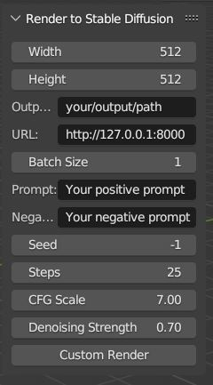
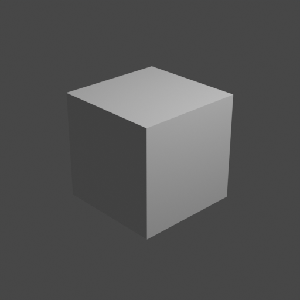
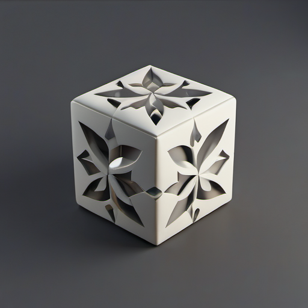

# Stable Diffusion integration to Blender render
## Description

Integration of img2img API endpoint to Blender

### Installation

Compress .py script in zip, and install via Edit -> Preferences -> Addons -> Install
## Usage

<ins>running Automatic1111 Web UI needed</ins>

1. Specify url to your running Web UI.
2. Specify output folder for images.
3. Specify generation parameters

## UI

## Example

  

    
Render

    
  

  

    
img2img result

    
  

## To do

1. Provide more control on image generation via ControlNet

2. Provide flexible configuration of render

3. Adjustments
